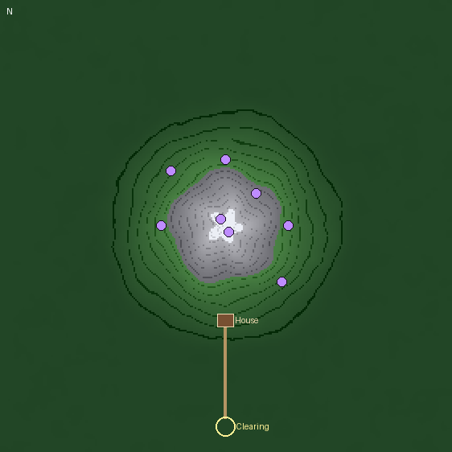

# The Altus

A NeoForge mod for Minecraft 1.21.1. Each world generates a pantheon of gods with a history of
grudges, alliances, lies, secrets and the occasional deicide. Players dream their way into the
Altus to recover fragments of that history, and the gods take notice.

## Status

**Slice 5: stakes.** Every world generates its history from its seed. Players dream their way into
the Altus, find lore and write it in Tomes, climb the Mountain to the gods' doors and sanctums, and
now face their guardians, can carry one thing into a dream, and can enter the ruins of dead gods.

### Dreaming

Sleep in a bed at night with blocks a god likes nearby (within 8 blocks). Each liked block adds a
point for that god and each disliked block takes one away. If one god reaches 4 points, you dream
toward it; if two gods tie for the lead, you dream of the Woods with no focus; if no god reaches 4,
you sleep normally. You can dream once per night.

In the Altus your inventory is stashed and you arrive empty-handed in the Woods. The dream lasts
10 minutes. Dying there just wakes you. When you wake, anything you picked up in the Altus
vanishes and your own things come back. A crash or disconnect mid-dream is repaired on login.

The Altus is a dark forest at sunset, the same shape in every world, with an enormous Mountain at
its center: the forest climbs its lower slopes, bare stone above, snow at the summit. Dreamers
arrive in the **Clearing**, south of the Mountain, where four carved **Inscriptions** stand. Each one speaks of the god your dream leans
toward: what it loves, what it hates, its nature, and how it came to be. A dream with no focus
speaks of the god who made the world. A god whose very existence is a secret has had its carvings
scraped away.

### Memories and the Tome

Reading an inscription gives you a memory, but you can't make sense of it in the Altus. When you
wake, your memories become readable and start to fade: the **Fading Memory** effect shows how long
the last one has left (45 minutes by default). A memory that fades is gone, though you can find it
again by dreaming.

To keep a memory, write it in a **Tome**: craft one from a book and quill surrounded by eight
rotten flesh. Open the Tome, press **Write a memory**, and pick one; it is written onto the page
with the day you wrote it. Give each Tome a title in the box at the top; it becomes the Tome's
name. The pages are also yours to write on freely, and nothing marks an
entry as authentic, so you can lie in your Tome if you like. Behind the scenes, the game keeps a
hidden record of each real entry (dropped if you edit the entry away) and of what you have
learned. Those records are what the Altus's gates will check later.

### The Mountain and the sanctums

A road leads north from the Clearing to the **House** on the Mountain's southern slope. The
Mountain has eleven places where a god's door can stand: two on the summit, six around the slopes,
and three inside the House (the Hearth, the Cellar Stair and the Locked Attic). The mightiest
living gods hold the highest doors. Each door is framed in its god's liked blocks, so if you know
what a god loves you can recognize its door. A dead god's door is a cobwebbed ruin.

A door opens only for someone who has written down at least one thing about its god. Behind it is
the god's **sanctum**, built from its liked blocks:

- a **gallery** of murals (level 2 lore): what the god thinks of others, its grudges, its groups;
- an **archive** of **Reliquaries** (level 3 lore), which open only if you have written at least two
  things about the god: the god's own account of what it has done, lies included, and where
  another god's door stands;
- a sealed inner door, for later.

A dead god's door opens onto what is left of its sanctum: cracked, overgrown and mostly dark. Its
first reliquary holds the corpse's own memory of its death, which names its killers even if the
killing was a secret. Lore that deep (level 4) needs three things written about its keeper.

### Guardians and the Altar

**Warden Stones** stand beside the doors on the slopes and in every sanctum's entry and archive.
When a dreamer comes near, a stone calls up the god's guardians: the hostile creatures it likes
(skeletons, spiders, drowned, endermen, phantoms or witches), or zombies if it likes none. Mightier
gods are better guarded, up to four per stone. The House is safe. Dying in the Altus only wakes
you.

Since you arrive with nothing, you may want to bring a weapon. Craft an **Altar** (a candle on top,
an ender pearl in the middle between two stone bricks, and three stone bricks along the bottom).
Use it while holding something to leave one of it there; the next time you dream, it comes with
you. It cannot be dropped in the Altus, and when you wake it returns to your inventory, worn by
whatever you did with it. Use the Altar empty-handed to take it back without dreaming.

Write down where a god's door is, and the next time you dream toward that god you wake at its door
instead of the Clearing. Deeper memories fade faster: level 2 in about 35 minutes, level 3 in
about 25.

**Upgrading a test world:** the Mountain only appears in newly generated parts of the Altus. For a
world that already visited the Altus in an earlier version, delete the world's
`dimensions/altus/altus` folder (or start a new world).

Echoes, the sealed inner sanctums, the House's vaults and study, and favor with the gods come in
the next slices.

### Operator commands

These need permission level 2, because they spoil the mystery.

- `/altus history`: a summary of the pantheon.
- `/altus dump`: writes the full history, with sample lore fragments, to
  `<world folder>/altus/history.txt`. Use it to see what each god likes.
- `/altus scan`: how the blocks around you score for each god, and who a sleeper here would
  dream toward.
- `/altus dream [seconds]`: enter the Altus at once, as if asleep where you stand.
- `/altus wake`: leave the Altus at once.
- `/altus sites`: the Mountain's door sites, who holds each, and where.
- `/altus visit <god number>`: while dreaming, jump to a god's door (numbers from `/altus history`).

### Settings

`<world>/serverconfig/altus-server.toml`: `dreamSeconds` (default 600), `scanRadius` (8),
`scanThreshold` (4) and `fadeMinutes` (45).

## Getting the jar

Every push to `main` is built by GitHub Actions:

1. Open the **Actions** tab and pick the latest green run.
2. Download the `altus-mod-jar` artifact (a zip containing the jar).
3. Put the jar in the `mods` folder of a NeoForge 21.1.x install for Minecraft 1.21.1.

## Building locally

You need JDK 21. Run `./gradlew build`; the jar lands in `build/libs/`.

## What CI checks

- Compiles the mod and runs the unit tests (the history engine is verified against the original
  JavaScript prototype using golden hashes).
- Starts a real dedicated server with the mod and checks, in the running game: the Altus loads
  with solid ground; the bed scan counts every block tag; a mock player dreams and wakes with its
  inventory intact; dying in the Altus wakes it; sleeping in a bed at night beside a god's blocks
  dreams toward that god; a second dream the same night is refused; the four inscriptions stand in
  the Clearing; reading them in a dream gives four memories that become readable on waking; one
  is written into a Tome with its hidden record; editing it away drops the record; the rest fade;
  the Mountain stands at the height the terrain math predicts; every living god's door is built;
  a door refuses a stranger and admits someone who knows its god; a mural gives its lore; a
  reliquary refuses until you know its keeper well enough; the exit leads back to the door; and
  knowing where a door is makes you wake there; a Tome keeps its title, cleaned of formatting; an
  item left on an altar goes into the dream alone, can't be lost there, and comes back worn, while
  things picked up in the dream vanish; a Warden Stone calls its god's liked creature up to the
  god's limit; and a ruin's reliquaries open only for those who know its keeper well enough. The
  smoke world uses seed 14, which has a ruin whose corpse remembers a secret killing.
- Publishes the build log, test results and the smoke-test history to the `ci-logs` branch.

## Layout

- `io.github.bargainbinbastard.altus.history` — the history engine. Pure Java, no Minecraft code.
- `io.github.bargainbinbastard.altus.lore` — glue between the engine and the running game.
- `io.github.bargainbinbastard.altus.dream` — the Altus dimension and its terrain, sleeping into it,
  and waking.
- `tools/` — the original prototype and the parity scripts.
